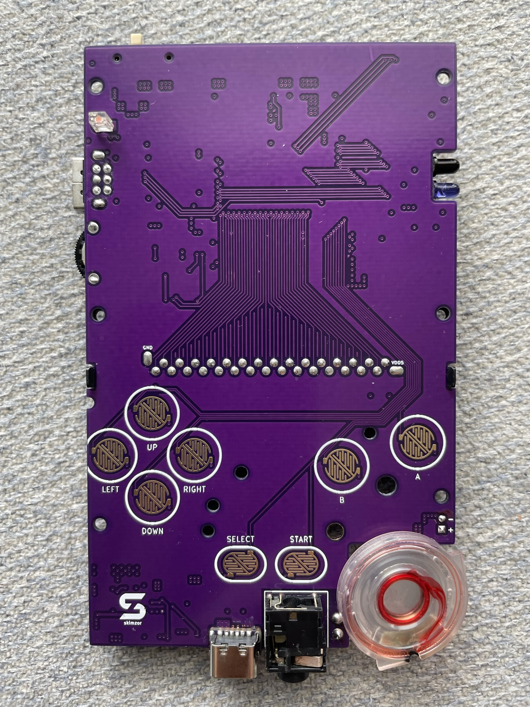
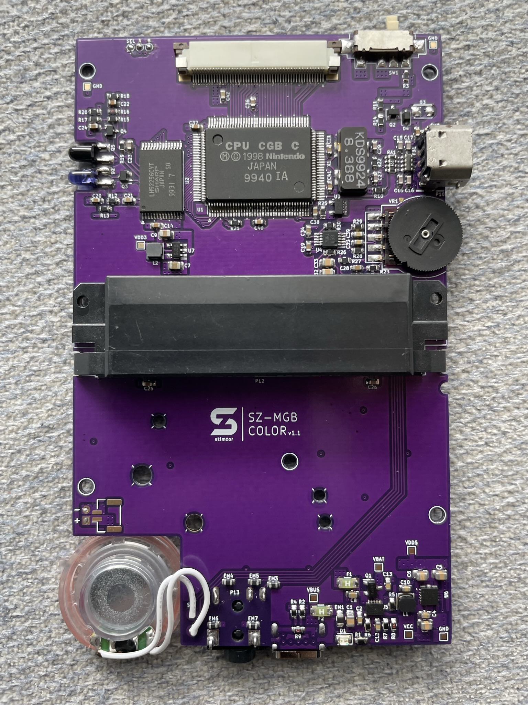

# SZ-MGBC
Inspired by Zekfoo's AGZ and CGZ, I designed and created the SZ-MGBC - a Game Boy Color in the form-factor of a Game Boy Pocket.

# Features
- USB-C Rechargeable LiPo battery
- Safe Charge and Play
- Game Boy Color in Pocket form-factor

# Credit and Thanks

- miketf1#1462 for agreeing to handle all technical support and troubleshooting issues for this project.
- [gekkio](https://gekkio.fi/) for their CPU, RAM, Link Port [KiCad footprints](https://github.com/Gekkio/gekkio-kicad-libs) and overall contributions to the Game Boy community.
- [HDR](https://martinrefseth.com/) for compiling schematics, list of components, and board scans and their overall contributions to the Game Boy community.
- Krystalize for the [CGB board scans](https://nintenfo.github.io/repository/systems/GBC/documentation/schematics/).
- [Zekfoo](https://github.com/Zekfoo) for the inspiration for this project through their creation of the AGZ/CGZ/gbaHD-AIO.
- [Bucket Mouse](https://mousebitelabs.com/) for help with the audio circuit.
- Various members of the Game Boy Discord community who helped troubleshoot/brainstorm ideas.
